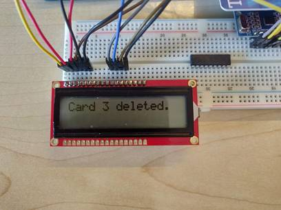

# NFC-doorlock---atmega-16a

This project is made for Atmega 16a and Atmega 32.  
Project is written in C and in Atmel Studio IDE  

## For replicating this project you will need:

Component | Function
------------ | -------------
[ATMega16a](images/image001.png) | Main microcontroler
[LCM1602C LCD](images/image003.png) | Shows the states of the program
[MFRC522](images/image009.png) | Reads and writes to RFID card
[RFID Cards](images/image013.png) | Used to varify the user
[Breadboard](images/image015.png) | Used to test all the components

## Final design:

## All the states of the system:
State | Image
------------ | -------------
Main screen | 
No stored cards message | 
Scan card menu | 
Delete card menu | 
Card deleted message | 
Unknown card message | 
Add card menu | 
Card saved message | 
Memory flushed | 

